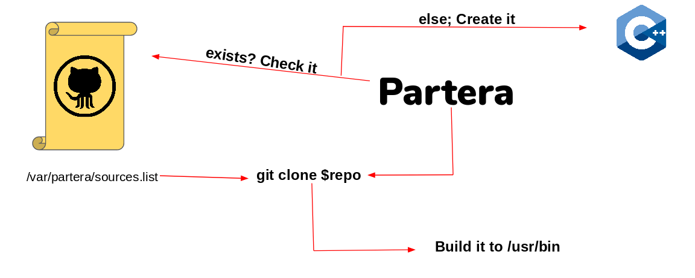

# partera
It is a free tool that can be used in organizations to download and use only software developed by workers and uploaded to github and, in this way, control better what software is downloaded into the organization's systems. A graphical example of how partera works.



We only have to specify the github username and the repository. The usage is the following
 - u: Specify the git user
 - r: Specify the git repo
 
```
Examples of use
=============================
partera -u [USER] -r [REPO] 
```

# Install
To install partera tool, you should

```
git clone https://github.com/hippi3c0w/partera.git
cd partera
cp -pv pantera /usr/bin
```

# Disclaimer
This software can be used only in GNU/Linux distros
